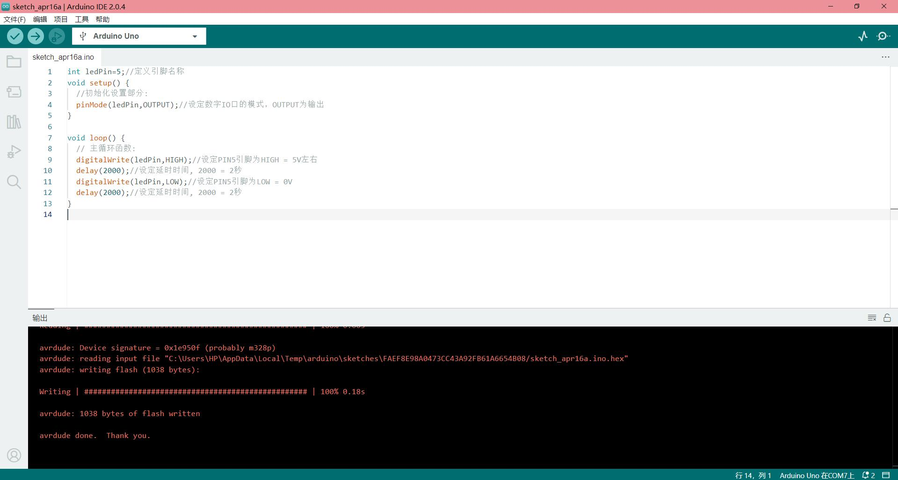
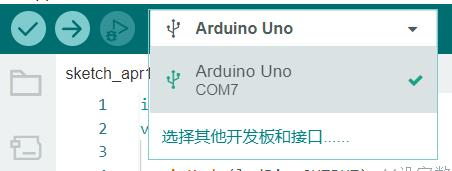
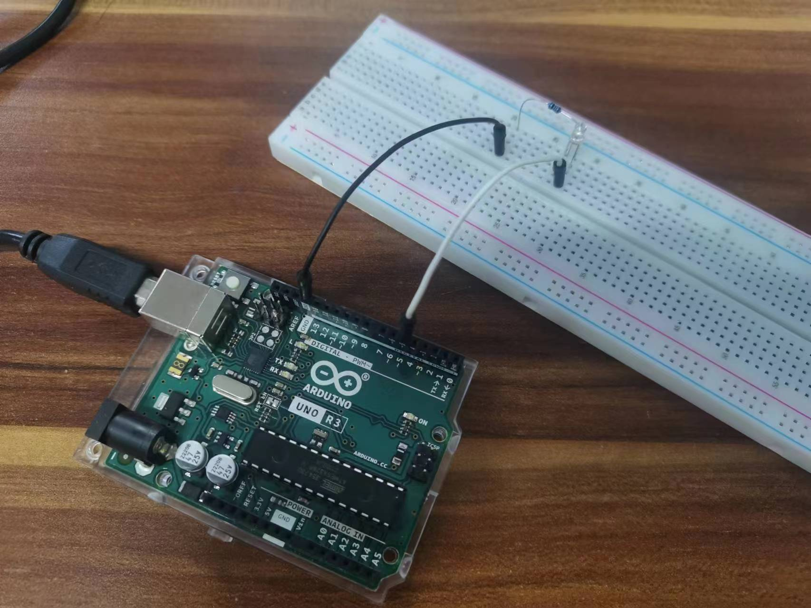
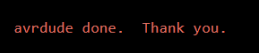
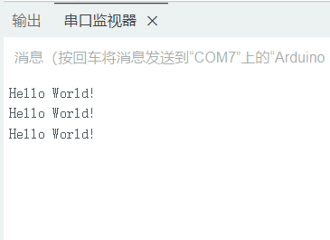

# Arduino入门教程

入门教程是以熟悉的闪烁`LED`和输出`Hello World!`为示例,了解Arduino的开发使用流程。

## 软件

### 下载安装

开发环境使用的是`ArduinoIDE`,我们可以在它的[官方网站](https://www.arduino.cc/en/software)上下载适合自己电脑操作系统的安装包。

下载好后安装即可,具体的安装过程请见[安装教程](ide.md#_1)。

### 软件汉化

安装完成后,运行`arduino.exe`就进入了开发集成环境界面,选择左上角菜单栏的`File(文件)`中的`Preferences(首选项)`,在Language下拉选项中选择`中文(简体)`,并点击`OK`按钮,等待软件重启,界面就更改为中文。可以正常使用了。

### 界面简介

整个界面非常简洁,易上手。



界面中间部分是输入代码的部分，下方黑色区域是各种操作的反馈输出区域，左侧是一些管理类的功能，上方是最常用的验证、上传、调试、选板，以及右侧的串口有关的功能，最上面是菜单栏，所有的命令功能都可以在菜单中找到。

### 端口和板型选择

在正式使用前需要选择连接端口号和开发板型号。

通常来说，在将电脑和开发板连接好后，软件会自动识别端口和板型，但如果没有识别到，我们可以自己手动在菜单栏-工具中选择开发板和端口。



## 硬件

### 器件清单

使用到的硬件器材包括以下几个:

- Arduino开发板
- USB连接线
- 面包板
- 2根杜邦线(双公口)
- 1个LED
- 1个1k电阻

### 器件连接

将所有用到的器件按照下方描述连接起来:

1. 使用USB数据线,将电脑与开发板连接
2. 使用杜邦线将开发板上`GND`端口与`5`号端口引出
3. 将电阻、LED串联,并与上一步引出的两个端口相连(注意:LED长的引脚为正极,与`5`引脚相连;短引脚为负极,与`GND`引脚相连;并为保证限制流过LED的电流不会过大,必须串入限流电阻)

最终连接结果如下图:



## 程序

### `LED`闪烁

将下方示例程序复制进软件,之后点击左上角`验证`。

```arduino
int ledPin=5;//定义引脚名称
void setup() {
  //初始化设置部分:
  pinMode(ledPin,OUTPUT);//设定数字IO口的模式，OUTPUT为输出
}

void loop() {
  // 主循环函数:
  digitalWrite(ledPin,HIGH);//设定PIN5引脚为HIGH = 5V左右
  delay(2000);//设定延时时间, 2000 = 2秒
  digitalWrite(ledPin,LOW);//设定PIN5引脚为LOW = 0V
  delay(2000);//设定延时时间, 2000 = 2秒
}
```

编译完成后如果显示生成代码的大小,证明编译成功。


点击上传按钮,将代码写入开发板的控制器中,稍等片刻,完成后会有提示。然后就可以看到LED开始闪烁。



### 输出`Hello World!`

大致步骤与上方相同,使用到的程序如下:

```
void setup() {
  //初始化设置部分:
  Serial.begin(9600);//打开串口,设置波特率为 9600 bps
}

void loop() {
  // 主循环函数:
  Serial.println("Hello World!");//串口打印 Hello World! 字符串
  delay(1000);//设定延时时间,1000 = 1秒
}
```

验证、上传完成后点击软件右上角的`串口监视器`,就可以看到发送回来的消息。



## 拓展

至此，`Arduino`的入门教程到此结束,想要更加深入的了解并使用,需要学习以下内容:

- [Arduino基础](base.md)
- [ArduinoIDE使用](ide.md)
- (未完待续...)
